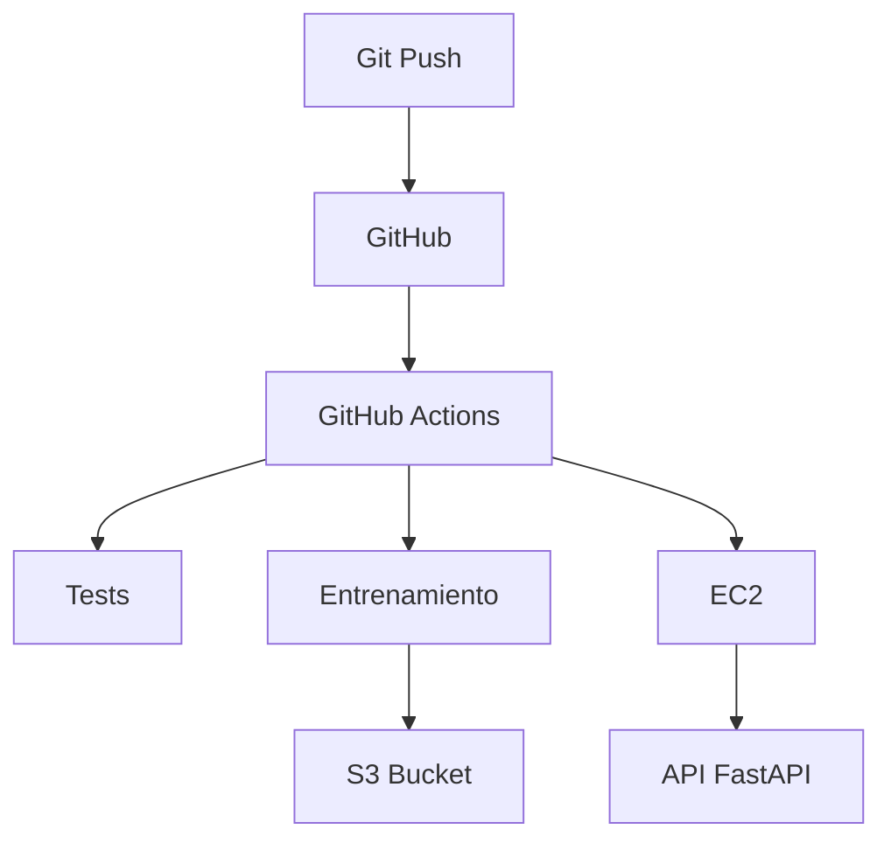

# Proyecto Final - MLOps End-to-End

## Descripción
API de Machine Learning para predicción de precios de viviendas con:
- CI/CD con GitHub Actions
- Almacenamiento en AWS S3 con DVC
- Reentrenamiento automático diario
- Despliegue en EC2

## Tecnologías
- FastAPI, Python, Scikit-learn
- AWS EC2, S3
- GitHub Actions
- DVC

## Endpoints
| Método | Endpoint | Función |
|--------|----------|---------|
| GET | /health | Health check |
| POST | /predict | Predicción |
| POST | /train | Reentrenar modelo |
| GET | /docs | Documentación |

## API Desplegada
**URL:** http://3.151.94.62:8000

## Diagrama de Arquitectura

## Configuración Local
1. Clonar repositorio
2. Crear archivo `.env` con credenciales AWS
3. `pip install -r requirements.txt`
4. `python scripts/train.py`
5. `uvicorn app.main:app --reload`

## Autor
Ivan Cespedes
